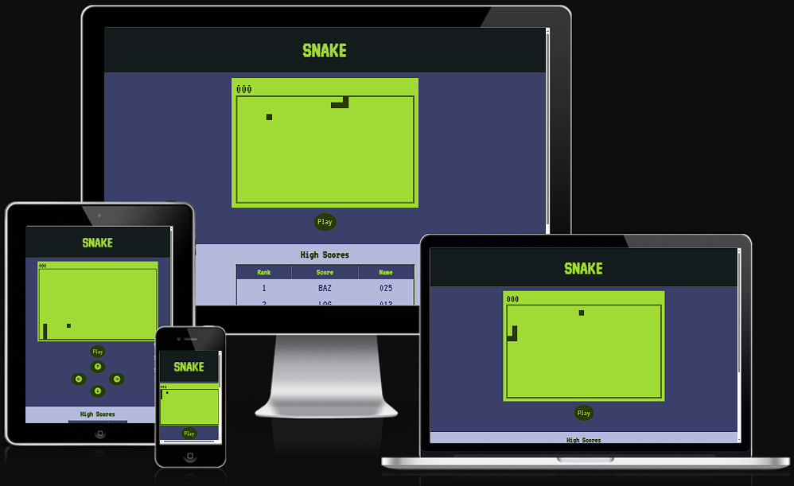

# Snake

I chose to build a Snake game for my JavaScript project due to its nostalgic appeal, reminiscent of classic arcade gaming. Additionally, it provided a valuable opportunity to explore complex game mechanics and hone my coding skills while delivering a fun and engaging user experience.

"In 1997, Nokia put Snake on a phone called the Nokia 6110. Yes, the phone your father used for work purposes and you did, for playing Snake. This was the beginning of Snake in your pocket, the game almost went viral, signalling a new era in mobile phone gaming."

"What started in 1997, reached viral status in the year 2000, with the launch of the Nokia 3310. One of the best selling mobile phones of all time, the Nokia sold 126 million units of this device in that year. Residing within the device, was Snake, the game that quickly became a household name in India and the world alike."

A brief history can be found here: https://www.digit.in/features/mobile-phones/a-brief-history-of-snake-33913.html

[View Snake live project here](https://barrycflynn.github.io/Snake/)

### Table of Contents

- [User Experience](#user-experience)
- [User Stories](#user-stories)
- [Features](#features)
- [Existing Features](#existing-features)
- [Features Left to Implement](#features-left-to-implement)
- [Challenges Faced](#challenges-faced)
- [Testing](#testing)
- [Deployment and local development](#deployment-and-local-development)
- [Design](#design)
- [Technologies Used](#technologies-used)
- [Sites & Programs Used](#sites--programs-used)
- [Credits](#credits)

---

### User Experience

#### Game Objective 
- The goal of the game is to control the snake's movement and guide it to eat the food that appears on the screen. As the snake consumes food, it grows longer, and your score increases.

#### Controls 
- You can control the snake using either the arrow keys on your keyboard or on####screen buttons if you're playing on a mobile device.

#### Scoring 
- Your score is displayed at the top of the screen. Each food item you eat increases your score. Try to achieve the highest score possible!

#### High Scores 
- After each game, if your score is among the top 5, you'll be prompted to enter your name. Your high score will be recorded and displayed on the High Scores table.

#### Modal 
- If you achieve a high score, a modal will appear, allowing you to enter your name for bragging rights. Your rank will be displayed alongside your score.

#### Enjoy the Challenge 
- Challenge yourself to beat your own high score or compete with friends and family to see who can become the ultimate Snake champion!

---

### User Stories

#### For First-time Visitors
- When first visiting the website, I want to be immediately drawn to the game area with a clear depiction of the Snake and a Play button that encourages me to start a game.
#### For Returning Visitors
- As a returning visitor, I aim to play the game again and challenge myself to surpass the existing High Scores.
#### For Frequent Users
- For those who frequently play the game, my goal is to continually improve and strive to achieve the highest scores on the leaderboard.

---

### Features

- Classic Gameplay Enjoy the timeless fun of guiding the snake to eat food and grow longer.
- High Scores: Compete with friends and aim for the top spot on the high scores table.
- Responsive Design: Play on various devices, as the game adapts to different screen sizes.

---

### Existing Features

#### Classic Snake Gameplay
- Experience the nostalgia of the original Snake game, where you control a snake to collect food and grow longer. Avoid collisions with walls and your own tail to stay in the game.

#### High Scores
-  Keep track of your best scores and compete with yourself or others to achieve the highest score possible. The game maintains a high scores table to showcase your achievements.

#### Responsive Design
- Play the game seamlessly on a variety of devices, including desktops, laptops, tablets, and mobile phones. The responsive design ensures an enjoyable gaming experience regardless of your screen size.

#### Modal Dialog
- When you achieve a high score, a modal dialog appears, allowing you to enter your name and save your score. This feature adds a personal touch to the game and motivates players to aim for the top of the leaderboard.

#### Mobile-Friendly Controls
- Navigate the snake easily on mobile devices using on-screen buttons for directional control, enhancing the game's accessibility and playability on touchscreens, the buttons will appear at screen resolution below 1024 px.

---

### Features Left to Implement

#### Persistent High Score Table
- Implement a feature to store high scores in browser storage or on a server, ensuring that the high score table retains player achievements even after closing the game. This adds a sense of competition and motivation for players to improve their scores over time.

#### Mobile Device Vibration
- Enhance the mobile gaming experience by adding haptic feedback (vibration) when players press arrow buttons to control the snake's direction. This tactile feedback provides a satisfying and responsive feel to the game, making it more engaging and enjoyable on touch devices.

#### Mobile Landscape Redesign 
- When playing the game in landscape mode on mobile devices, the current layout with on-screen buttons may not be optimized. It's worth exploring a redesign to better accommodate landscape orientation.

---

### Challenges Faced
#### Understanding Game Mechanics 
- Adapting the Snake game from a tutorial presented a challenge in grasping its core mechanics. This involved comprehending how movement, growth, and collision detection worked within the game's logic.

#### Implementing High Score Table 
- Creating a functional high score table within the game loop posed a significant challenge. This required integrating the table seamlessly with the game's mechanics and ensuring it updated accurately.

#### Designing the Modal
- Developing the modal for player input and high score display within the game loop presented challenges. Ensuring its proper functionality and integration into the game was a key aspect of the project.

#### Mobile Compatibility
- Making the game mobile-friendly required creating on-screen touch controls that worked harmoniously with the keyboard inputs. Adjusting the spacing and responsiveness of on-screen arrow keys was an iterative process.

---

### Testing 

Linter - PASS

  - Javascript tested on both sites with no significant errors

    - [JSHint](https://jshint.com/)
    - [JSLint](https://www.jslint.com/)

Lighthouse  -  PASS

- Mobile

    

- Desktop

    

W3C Markup Validtor - PASS

            

W3C CSS Validator - PASS

        

Responsive - PASS

- Resolutions checked

    - 320x568: Used by small smartphones or devices in portrait mode.
    - 375x667: Used by smartphones like iPhone 6/7/8 in portrait mode.
    - 360x640: Common resolution for many budget and mid-range smartphones.
    - 414x896: Found on various iPhone models like iPhone X, XS, 11 Pro, and 12 Pro.
    - 768x1024: Common resolution for tablets in portrait mode, such as the iPad.
    - 1024x768: Another common resolution for tablets, especially in landscape mode.
    - 1280x800: Common resolution for smaller laptops and tablets.
    - 1366x768: Common for laptops and desktop monitors.
    - 1920x1080: Full HD resolution, used on larger monitors, laptops, and some mobile   devices.
    

#### Manual Testing

- The website was tested on Google Chrome and Microsoft Edge.
- The website was viewed on various monitors and resolutions and on a Pixel 7 mobile phone.
- Chrome Dev Tools was used to test how the site looks on various screen sizes.

#### Bug Fixes and Improvements

##### High Score Table Headers Not Displaying:

Issue: The high score table headers were not showing up in the table.
Resolution: The code was modified to target only the tbody of the table, leaving the headers intact.

##### Scrolling Interference During Gameplay:

Issue: Scrolling was not disabled while the game was running, causing interference.
Resolution: JavaScript was used to disable scrolling during gameplay and re-enable it when the game ends.

##### Modal Not Updating High Scores Table:

Issue: The modal was not updating the high scores table after entering the player's name.
Resolution: The code was restructured to ensure that the high scores table updates correctly after entering the player's name in the modal.

##### Mobile Button Layout Issue:

Issue: The on-screen buttons for mobile had spacing issues.
Resolution: The layout of on-screen buttons was adjusted to ensure proper spacing and alignment.

##### Modal Display Issue:

Issue: The modal was not displaying after game over.
Resolution: JavaScript was used to trigger the modal's display when the game ends.

##### Arrow Keys Scrolling Page:

Issue: Arrow keys were scrolling the webpage in addition to controlling the game.
Resolution: JavaScript was added to prevent the arrow keys from scrolling the webpage during gameplay.

##### White Space in High Score Table:

Issue: Entries in the high score table had default values of "000" for score and empty for name, even before any scores were added.
Resolution: JavaScript code was implemented to display blank entries in the high score table until scores are added.

#### Unfixed Bugs

When playing the game in landscape mode on mobile devices, the current layout with on-screen buttons are off screen, I am not familiar with Game Design to suggest an alternative button layout that would operate intuitively.

---

### Deployment and local development

#### GitHub Pages

GitHub Pages used to deploy live version of the website.
1. Log in to GitHub and locate [GitHub Repository Snake](https://github.com/barryCFlynn/Snake)
2. At the top of the Repository(not the main navigation) locate "Settings" button on the menu.
3. Scroll down the Settings page until you locate "GitHub Pages".
4. Under "Source", click the dropdown menu "None" and select "Main" and click "Save".
5. The page will automatically refresh.
6. Scroll back to locate the now-published site [link](https://barrycflynn.github.io/Snake/) in the "GitHub Pages" section.

---

### Design

#### Colour Scheme
- The color scheme was selected to emulate the design of the Nokia 3310, featuring a transition from the iconic blue casing to subtle gray accents and a vibrant green screen. All design was first tested on Figma.
    - Primary Background Colour

        
    - Secondary Background Colour

        
    - Primary Text and Screen Colour
    
        

    - Secondary text and Screen Colour

         

    - Contrast Grid - Only AA and AAA options used.

        
            

#### Fonts
- 'VT323' font is main font used throughout the site for its retro game style and the fall back font is 'sans-serif'.

#### Layout
- Explored various game layouts and designs to ensure an engaging and intuitive experience for players. Considered factors like screen space utilization, ease of navigation, and visual appeal.
- Opted for a user-friendly layout featuring a clear game area with the snake drawn on it. Incorporated on-screen buttons for mobile users, enhancing accessibility and gameplay.

---

### Technologies Used

 - HTML
 - CSS
 - JavaScript
 - ChatGPT
 
---

### Sites & Programs Used

- [Educative](//https://www.educative.io/blog/javascript-snake-game-tutorial)
    - Walkthrough of game creation for basis of site, iterated on further
- [VS Code](https://code.visualstudio.com/)
    - Code editor.
- [Git](https://git-scm.com/)
    - To manage version control and push updates to GitHub.
- [Github](https://github.com/)
    - File Storage and Hosting the website.
- [Google Fonts](https://fonts.google.com/)
    - Import main font the website.
- [Chat GPT](https://openai.com/blog/chatgpt)
    - Only used for troubleshooting.
- [Am I Responsive](https://ui.dev/amiresponsive)
    - Mockup picture for the README file.
- [8 Shapes Contrast Grid](contrast-grid.eightshapes.com)
    - Used to make sure colours are compliant.
- [Adobe Color](https://color.adobe.com/create/color-wheel)
    - Used to select colours on the site
- [Figma](https://www.figma.com/)
    - Used to test webpage layout and design

---

### Credits

- [Educative](//https://www.educative.io/blog/javascript-snake-game-tutorial) This website played a pivotal role in bringing my project to life. It provided essential guidance on creating an interactive game, which I wouldn't have been able to accomplish without. It's important to note that the code underwent significant changes to make this project.
